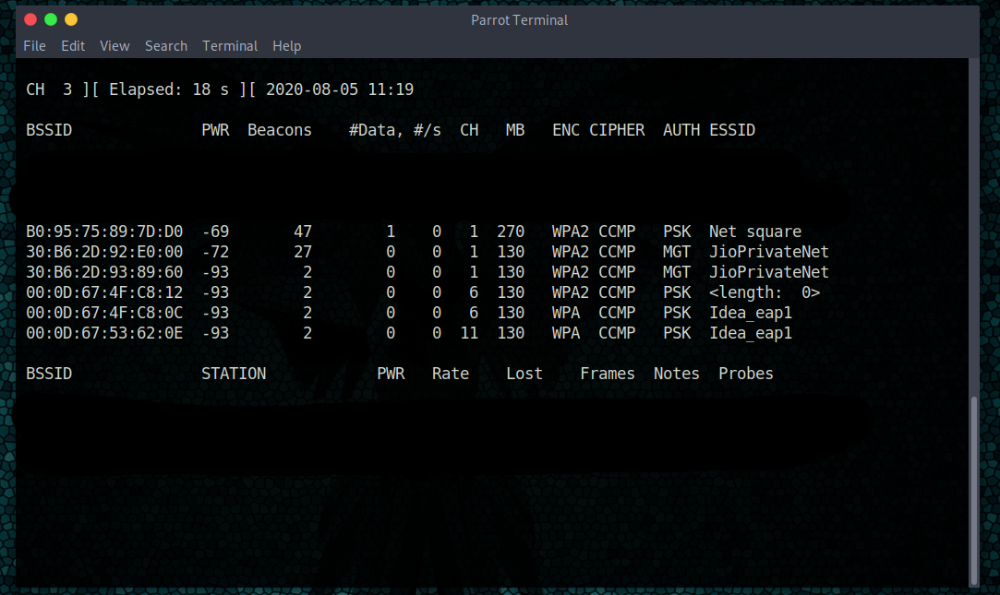

# Setup for TP-Link wn722n v2 for Pen-Testing

TP-link wn722n has realtek rtl8188eu drivers that are not compatible for monitoring mode without some changes.

1. First of all follow the instructions on the main.txt file.
    -   Do it as root user, see 
    -   Do an update after that, using "apt-get update && apt-get upgrade -y" 

2. Add the line in NetworkManager.conf 
    -   Open NetworkManager.conf by the command "nano /etc/NetworkManager/NetworkManager.conf"
    -   Add lines from "network conf.txt" 
    -   Also change 'ifupdown' false to true.
    -   See 
   
3. See whether your are in 'Monitor' mode or not.
    -   Type in "iwconfig"
    -   Yours should look like this 

4.  See whether your adapter is WORKING in in monitor mode or not
    -   Type commands given in this pic  then 
    -   You will then be able to see interfaces around you like 
    
5.  Update Your CRONTAB [VERY IMPORTANT]
    -   Open crontab by typing ""crontab -e"
    -   Add the last two lines you see in  to your crontab (you will find those command in main.txt){there are 1 tab diff. not 1 space between them}.
    -   Save with ctrl+o, then exit with ctrl+x.
    
6.  Reboot

7.  Open terminal on Desktop 
    -   Open terminal and login as 'su' by typing command "sudo su".
    -   Type "iwconfig" and check that your adapter is in auto mode.
    -   Copy "m.sh" file to Desktop as you will need that.
    -   Open Terminal on Desktop as you see in . See 
    -   Type "sudo bash ./m.sh" like 
   
8. HOOORAY!!! 
    -   Retype "iwconfig" and check that your adapter is in Monitor mode.
    -   NOW YOU ARE GOOD TO GO!!!
    

